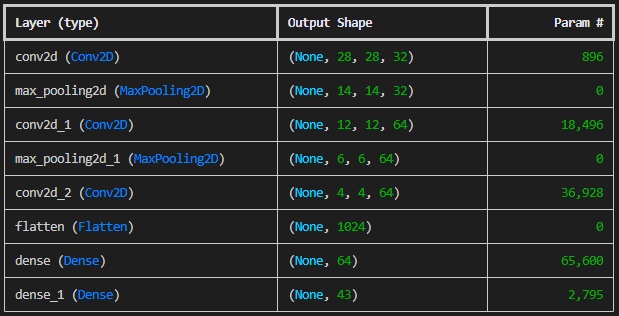
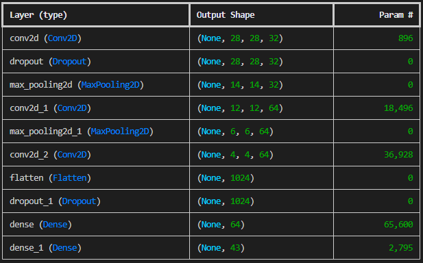

# Traffic
- The latest version of Python you should use in this course is Python 3.12. This is particularly the case for this project, due to interactions with TensorFlow.
- Write an AI to identify which traffic sign appears in a photograph.

```
$ python traffic.py gtsrb
Epoch 1/10
500/500 [==============================] - 5s 9ms/step - loss: 3.7139 - accuracy: 0.1545
Epoch 2/10
500/500 [==============================] - 6s 11ms/step - loss: 2.0086 - accuracy: 0.4082
Epoch 3/10
500/500 [==============================] - 6s 12ms/step - loss: 1.3055 - accuracy: 0.5917
Epoch 4/10
500/500 [==============================] - 5s 11ms/step - loss: 0.9181 - accuracy: 0.7171
Epoch 5/10
500/500 [==============================] - 7s 13ms/step - loss: 0.6560 - accuracy: 0.7974
Epoch 6/10
500/500 [==============================] - 9s 18ms/step - loss: 0.5078 - accuracy: 0.8470
Epoch 7/10
500/500 [==============================] - 9s 18ms/step - loss: 0.4216 - accuracy: 0.8754
Epoch 8/10
500/500 [==============================] - 10s 20ms/step - loss: 0.3526 - accuracy: 0.8946
Epoch 9/10
500/500 [==============================] - 10s 21ms/step - loss: 0.3016 - accuracy: 0.9086
Epoch 10/10
500/500 [==============================] - 10s 20ms/step - loss: 0.2497 - accuracy: 0.9256
333/333 - 5s - loss: 0.1616 - accuracy: 0.9535
```

## Data
The data needed for this can be found [here](https://cdn.cs50.net/ai/2023/x/projects/5/gtsrb.zip)

## Background
As research continues in the development of self-driving cars, one of the key challenges is computer vision, allowing these cars to develop an understanding of their environment from digital images. In particular, this involves the ability to recognize and distinguish road signs – stop signs, speed limit signs, yield signs, and more.

In this project, you’ll use TensorFlow to build a neural network to classify road signs based on an image of those signs. To do so, you’ll need a labeled dataset: a collection of images that have already been categorized by the road sign represented in them.

Several such data sets exist, but for this project, we’ll use the German Traffic Sign Recognition Benchmark (GTSRB) dataset, which contains thousands of images of 43 different kinds of road signs.

## Understanding
First, take a look at the data set by opening the gtsrb directory. You’ll notice 43 subdirectories in this dataset, numbered 0 through 42. Each numbered subdirectory represents a different category (a different type of road sign). Within each traffic sign’s directory is a collection of images of that type of traffic sign.

Next, take a look at traffic.py. In the main function, we accept as command-line arguments a directory containing the data and (optionally) a filename to which to save the trained model. The data and corresponding labels are then loaded from the data directory (via the load_data function) and split into training and testing sets. After that, the get_model function is called to obtain a compiled neural network that is then fitted on the training data. The model is then evaluated on the testing data. Finally, if a model filename was provided, the trained model is saved to disk.

The load_data and get_model functions are left to you to implement.

## Specification
Complete the implementation of load_data and get_model in traffic.py.

- The load_data function should accept as an argument data_dir, representing the path to a directory where the data is stored, and return image arrays and labels for each image in the data set.
  - You may assume that data_dir will contain one directory named after each category, numbered 0 through NUM_CATEGORIES - 1. Inside each category directory will be some number of image files.
  - Use the OpenCV-Python module (cv2) to read each image as a numpy.ndarray (a numpy multidimensional array). To pass these images into a neural network, the images will need to be the same size, so be sure to resize each image to have width IMG_WIDTH and height IMG_HEIGHT.
  - The function should return a tuple (images, labels). images should be a list of all of the images in the data set, where each image is represented as a numpy.ndarray of the appropriate size. labels should be a list of integers, representing the category number for each of the corresponding images in the images list.
  - Your function should be platform-independent: that is to say, it should work regardless of operating system. Note that on macOS, the / character is used to separate path components, while the \ character is used on Windows. Use os.sep and os.path.join as needed instead of using your platform’s specific separator character.
- The get_model function should return a compiled neural network model.
  - You may assume that the input to the neural network will be of the shape (IMG_WIDTH, IMG_HEIGHT, 3) (that is, an array representing an image of width IMG_WIDTH, height IMG_HEIGHT, and 3 values for each pixel for red, green, and blue).
  - The output layer of the neural network should have NUM_CATEGORIES units, one for each of the traffic sign categories.
  - The number of layers and the types of layers you include in between are up to you. You may wish to experiment with:
    - different numbers of convolutional and pooling layers
    - different numbers and sizes of filters for convolutional layers
    - different pool sizes for pooling layers
    - different numbers and sizes of hidden layers
    - dropout
- In a separate file called README.md, document (in at least a paragraph or two) your experimentation process. What did you try? What worked well? What didn’t work well? What did you notice?

Ultimately, much of this project is about exploring documentation and investigating different options in cv2 and tensorflow and seeing what results you get when you try them!

You should not modify anything else in traffic.py other than the functions the specification calls for you to implement, though you may write additional functions and/or import other Python standard library modules. You may also import numpy or pandas, if familiar with them, but you should not use any other third-party Python modules. You may modify the global variables defined at the top of the file to test your program with other values.

## Notes on solution
The aim of this exercise was to experiment with the differing configurations of a Neural Net available through the TensorFlow library. In the `get_model` function there is a pretty ugly `if` statement which toggles between model options, configured using `MODEL_NUMBER`. As this code is purley for experimentation I did not waste time cleaning it up. Below are the notes on the different modles tried with their justifications and achieved results.

### Model 1
This first experiment simply follows [the example](https://www.tensorflow.org/tutorials/images/cnn) for a Convolutional Neural Network given in the TensorFlow docs. The model consists of a convolutional base using a common pattern of a stack of `Conv2D` and `MaxPooling2D` layers. We have three layers of `Conv2D`, interleaved with two `MaxPooling2D`. The first `Conv2D` has 32 filters, hence a depth of 32 and 32 possible 'features' to be learned. The other two `Conv2D` layers both have 32 features. The convolutional base is followed by flatten and dense layers. We have a `Flatten` layer to convert the 3D output of the convolutional base into a 1D vector, preparing it for the dense layers. We then have two `Dense` layers; the first fully connected layer with 64 neurons. It processes the flattened input to learn global patterns. The final dense layer with `NUM_CATEGORIES` neurons as we have `NUM_CATEGORIES` to classify. Here each neuron corresponds to a class. See below an output of the model's summary:



Below are some results:
- After 10 Epochs
  - 333/333 - 3s - 9ms/step - accuracy: 0.9545 - loss: 0.2556
- After 25 Epochs
  - 333/333 - 2s - 6ms/step - accuracy: 0.9761 - loss: 0.2043
- After 100 Epochs
  - 333/333 - 2s - 6ms/step - accuracy: 0.9806 - loss: 1.1820

We can see that we seem to be hitting a plateau in accuracy of this model. Further increasing epochs may see diminishing returns. We also see the loss starts to increase after 100 epochs which could be a sign of overfitting or class imbalances... this would need further investigation which I have not carried out here.

### Model 2
An interesting issue that potentially saw in Model 1 was model overfitting. Dropout is one technique used to try to make a neural network more robust to overfitting, amongst other things. Below are the points given in the text 'Artificial Intelligence: A Modern Approach (Fourth Addition) - Russel & Norvig'

> - By introducing noise at training time, the model is forced to become robust to noise.
>  - As noted above, dropout approximates the creation of a large ensemble of thinned networks. This claim can be verified analytically for linear models, and appears to hold experimentally for deep learning models.
>  - Hidden units trained with dropout must learn not only to be useful hidden units; they must also learn to be compatible with many other possible sets of other hidden units that may or may not be included in the full model. This is similar to the selection processes that guide the evolution of genes: each gene must not only be effective in its own function, but must work well with other genes, whose identity in future organisms may vary considerably.
> - Dropout applied to later layers in a deep network forces the final decision to be made robustly by paying attention to all of the abstract features of the example rather than focusing on just one and ignoring the others. For example, a classifier for animal images might be able to achieve high performance on the training set just by looking at the animal’s nose, but would presumably fail on a test case where the nose was obscured or damaged. With dropout, there will be training cases where the internal “nose unit” is zeroed out, causing the learning process to find additional identifying features. Notice that trying to achieve the same degree of robustness by adding noise to the input data would be difficult: there is no easy way to know in advance that the network is going to focus on noses, and no easy way to delete noses automatically from each image.

> Altogether, dropout forces the model to learn multiple, robust explanations for each input. This causes the model to generalize well, but also makes it more difficult to fit the training set—it is usually necessary to use a larger model and to train it for more iterations.

In Model 2 we added dropout to the input with probability 0.8 and dropout to the hidden layers with probabliity 0.5. These are simply the suggested values in the text 'Artificial Intelligence: A Modern Approach (Fourth Addition) - Russel & Norvig'. See below the output of the model's summary:



Below are some results:
- After 10 Epochs
  - 333/333 - 2s - 7ms/step - accuracy: 0.0554 - loss: 3.5067
- After 100 Epochs
  - 333/333 - 2s - 7ms/step - accuracy: 0.0481 - loss: 3.4985

We can see a massive reduction in accuracy, however over a similar number of epochs this is expected. It is an investigation for another day to see if, given very large number of epochs, dropout would improve accuracy over Model 1. I am however doubtful in this case give then change of accuracy from 10 to 100 epochs was negative...

### Model 1 with fixed kernel
Finally, one thing we would like to experiment with is adding some fixed kernel to the image before we pass it into the neural net. I will use the kernel from the lecture which aims to highlight edges in images before they are fed into the Neural Net. See the config value `APPLY_FIXED_KERNAL_TO_IMAGE`.

- After 10 Epochs
  - 333/333 - 3s - 8ms/step - accuracy: 0.9457 - loss: 0.2668
- After 100 Epochs
  - 333/333 - 4s - 12ms/step - accuracy: 0.9634 - loss: 2.3784

Interestinly we seem to have not improved on Model 1 without the fixed kernal in this case.

### Summary
The above three variations only aim to outline some of the few possibilities of CNNs. In fact, there are so many possibilities including, width, depth, activation function etc that trying to cover all the variations using a standard search would be far too time costly in reality. For a more in depth discussion of this topic refer to Chapter 22.5.2 in 'Artificial Intelligence: A Modern Approach (Fourth Addition) - Russel & Norvig'.